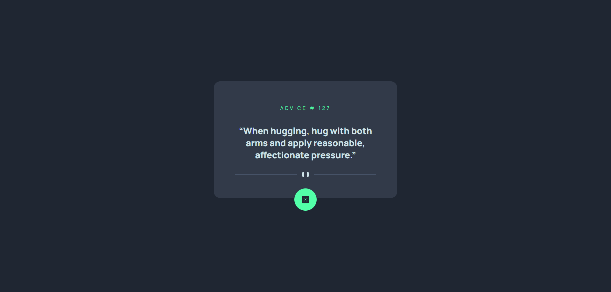

# 💬 Advice Generator App

**Advice Generator** is a simple and responsive web application that displays random pieces of advice to users. It was developed as a frontend exercise focused on API integration, dynamic content rendering, and minimalist UI design.

## 📸 Project Preview

  

## 🚀 Project Overview

This application fetches data from the [Advice Slip API](https://api.adviceslip.com/) and displays a random quote each time the user clicks the dice icon. It’s a great example of working with external APIs, managing state with React Hooks, and applying Tailwind CSS for quick and responsive styling.

## 🌟 Features

- 🔄 **Random Advice Generator**  
  Fetches new advice from the API on user interaction.

- ⚙️ **React Hooks for State Management**  
  Uses `useState` and `useEffect` for dynamic updates.

- 💅 **Clean & Responsive UI**  
  Styled with Tailwind CSS and fully responsive across devices.

- 🎲 **Interactive Dice Button**  
  Triggers new API requests with smooth transitions.

## 🛠️ Technologies Used

- **ReactJS** – Component-based UI library  
- **Tailwind CSS** – Utility-first CSS for fast styling  
- **Advice Slip API** – Public API for generating advice  
- **Vite** – Development build tool for lightning-fast loading

## 📚 Learning Goals

This project was built to practice:
- Fetching data from external APIs
- Managing side effects and user interaction
- Creating clean, responsive interfaces with Tailwind
- Deploying a React app using Vercel

## 🌐 Live Demo

Check out the live version here:  
👉 [advice-generator-abner.vercel.app](https://advice-generator-abner.vercel.app/)

## 📄 License

This project is for learning and portfolio purposes only.  
All content is generated via a public API and does not represent a real product.

---
